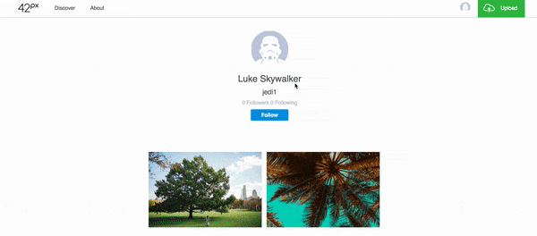
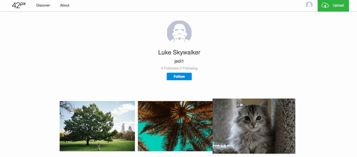

# 42 Px

Welcome to 42 px, a single paged web application inspired by 500px built with Ruby on Rails with PostgreSQL database on the backend and React/Redux on the front end.

## Key Features

### User Profiles
While 42px provides a guest log in to visitors, users can sign up and log in to the website.
Users can visit their own profile page, visit others' profiles, and also follow them.

### Uploading Photos
Users can upload their images on the website with ease with title, description, and automatically added amount of time since uploaded.
  Uploading photos.

Editing or deleting their own photos.

### Follows
Users can follow and unfollow other users.

## Responsive Web Design
All of 42px contents are responsive. Within size limits they will adjust automatically to the browser size, making it easier for users to interact with.

  

## Development Log

### Week 1
* Work on Auth
* Work on the backend of the web app
* CSS work on splash page, auth pages, and responsiveness
* Setup modal and core frontend items including reducers, actions, and etc.

### Week 2
* Create discover page, splash page for logged in users, and About page
* Enable modal and drop down feature
* Enable uploads, showing, editing, and deleting pictures.
* Temporarily put all available pictures for home feed.
* CSS work on every other pages to make similar to 500px.
